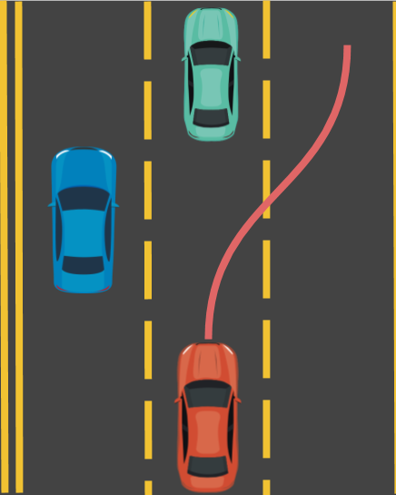
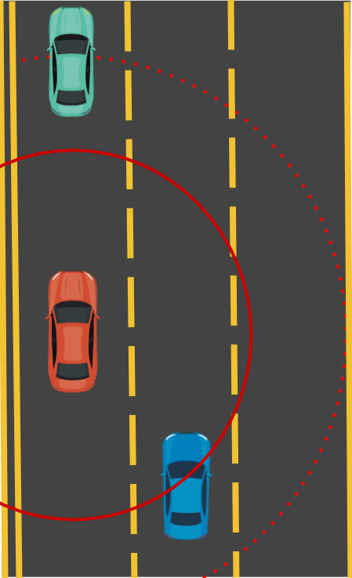
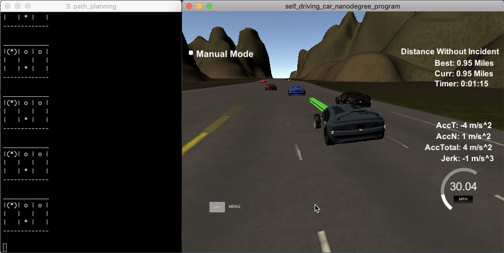
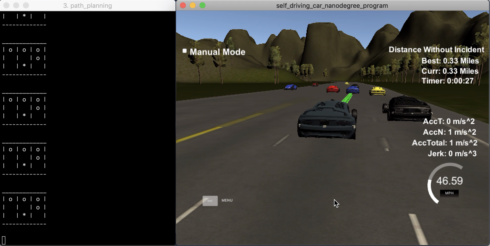

# Write Up

##  Objectives

Quote the objectives from [Readme](./README.md), the goal is to design and implement a path planner that is able to create smooth, safe paths for the car to follow along a 3 lane highway with traffic.

A successful path planner will be able to:
1. keep inside its lane,
2. avoid hitting other cars,
3. pass slower moving traffic all by using localization, sensor fusion, and map data.

In general, it expects the car to a little over 5 minutes to complete 1 loop in a highway scenario. Also, the car should not accelerate or jerk too quickly.


## Problem Statement

Given the vehicle's map and localization data, as well as its observations of the road, including the other car's positions, lanes, and speeds, the path planner should compute a safe (obstacle-free) trajectory so that the car stays in the lane with the light traffic as much as possible. Meanwhile, consider the speed limits in the highway scenario, the car should not move too slowly or quickly.

In other words, this project is to **implement a local planner to drive the car in the "right" lane**. Here, the "right" lane means where the traffics are ligher than other lanes.

In short, the inputs of the local planner include:
- Map and localization data: global coordinates, lanes of cars
- Sensor fusion data: other cars' identities, positions, speeds

And the outputs should be:
- A lane with light traffics
- Velocity control

In the instruction video, the lectures already give their interpolation method to generate and smooth a trajectory made of waypoints given the start and target waypoints, as the figure shows below. Consider this benefit, the major challenge turns to **how to find a target lane** given the planner's inputs.



Take the scenario of the above picture as an example, give the sensor fusion data, the RED car knows
1. it is running on the lane (1)
2. there is one car ahead on the same lane (1)
3. there is another car on the left lane (0)
4. there is no traffic on the right lane (2)

The local planner computes the "right" lane, which is lane 2 on the right and outputs a drivable path.

## A* Local Planner

My solution to the problem of finding the "best" lane for the vehicle is using the A\* search [1]. To apply this algorithm, the key is to build a virtual grid map for the vehicle and fill in the obstacles according to the car's sensing data. For simplicity, I use a 3x3 grid map along with the following symbols to represent the cars:

- `*`: the position of my self-driving car
- `o`: the other car
- `(*)`: the target position of my self-driving car

Take the figure above as an example, the grid map would become:

```
|   | o |(*)|
| o |   |   |
|   | * |   |
```

There are three assumptions to the grid map:
1. the start position of my car is always in the 3rd row
2. the target position of my car is always in the 1st row
3. the cost to visit each non-obstacle cell is 1

Therefore, the question of "which lane is the best one to drive" becomes: **"find the lane to which the cost of moving from the start position is the minimum"**.

In detail, the steps to construct a grid map using the sensor data are:
```
1. initialize a 3x3 grid with all free spaces
2. fill * (start position) in the cell at (2, my_lane_index)
3. for each car observed and localized by my sensor:
      ignore any car behind my car in the same lane
      if the car is in the front
          fill an obstacle in the cell at (0, car_lane_index)
      else if the car is almost in parallel with my car
          fill an obstacle in the cell at (1, car_lane_index)
      else
          fill an obstacle in the cell at (2, car_lane_index)
4. for each lane_index, set target position in one free cell at (0, lane_index)
```

So at maximum there would be 3 grids, do the A\* search for each grid map and select the target lane in which the path from start position has the minimum cost.

Take the scenario in the below picture as an example, suppose my car is the RED one. The dotted red circle represents my car's sensing range, so we know:

- my car is in lane 0
- a green car is in the lane 0 ahead
- a blue car is in the lane 1 almost in parallel
- no cars in the lane 2



Recall the map construction strategy above, there would be two possible grid maps accordingly:

```
| o |(*)|   |
|   |   |   |
| * |   | o |
```

and

```
| o |   |(*)|
|   |   |   |
| * |   | o |
```

By applying the A\* search to each of the maps, the best lane would be the middle lane because the path cost is 3, whereas the cost to the rightmost lane is 4.


Another example is shown in the simulation snapshot below, in which my car knows:

- itself runs on the middle lane
- one black car on the right lane ahead
- one blue car on the middle lane ahead
- does not detect the red car on the left lane because it is too far aways ahead

So the best lane for my car in this scenario is the left lane.



### Blocked Everywhere

It may happen that there are cars in each lane ahead, so my car is blocked. In this case, the target is missing, so the best strategy is keeping current lane as the snapshot below.




## References

[1] [Introduction to A*](http://theory.stanford.edu/~amitp/GameProgramming/AStarComparison.html)

[2] [Github: A* search in C++ by Damian Barczyński](https://github.com/daancode/a-star)
